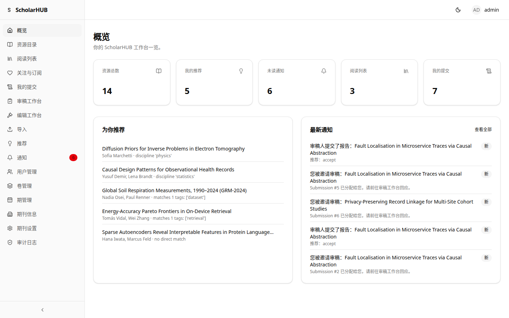
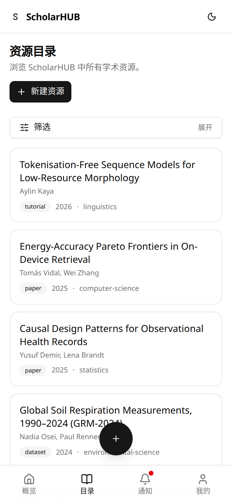
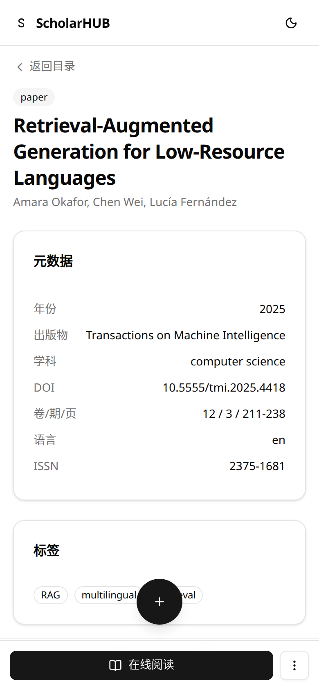

<div align="center">


# ScholarHUB

**开放学术出版平台 — Submit · Review · Publish · Read，一个代码库跑完整个出版闭环**

> 11 个后端模块 · 644 单元测试（84% 覆盖率）· 66 条 E2E 用例 · 全链路严格类型

**🌐 [English](README.md) · [简体中文](README.zh-CN.md)**

[](LICENSE)
[](https://www.python.org/)
[](https://fastapi.tiangolo.com/)
[](https://react.dev/)
[](https://www.typescriptlang.org/)
[](https://www.postgresql.org/)
[](https://docs.docker.com/compose/)
[](#测试)
[](#测试)
[](#测试)

**镜像仓库**：[GitHub](https://github.com/x33834/scholarhub) · [GitHub](https://github.com/Morningstar202604/scholarhub) · [GitCode](https://gitcode.com/badhope/scholarhub) · [Gitee](https://gitee.com/badhope/scholarhub)

**[功能一览](#功能一览) · [界面预览](#界面预览) · [架构](#架构) · [快速开始](#快速开始) · [技术栈](#技术栈) · [测试](#测试) · [文档](#文档)**

</div>

---

## 功能一览

| 角色 | 能力 |
| --- | --- |
| **作者** | 新建投稿（附 PDF）、多版本修订、跟踪审核状态（待审/大修/小修/录用/拒稿） |
| **编辑** | 审稿人指派、裁决（含编辑备注）、稿件管理工作台 |
| **审稿人** | 审稿报告、盲审（单盲/双盲）、决定建议 |
| **读者** | 公开目录检索、**浏览器内在线阅读（pdf.js）**、跨设备阅读进度、关注作者、订阅通知 |
| **管理员** | 用户/卷/期/期刊管理、审计日志、批量导入（BibTeX / RIS / CSV / DOI / arXiv） |

**安全默认开启**：WebAuthn 通行密钥 + TOTP 双因素、JWT 服务端吊销与密钥轮换、注册验证码、全操作审计日志、多租户隔离（PostgreSQL RLS）。

**轻量部署**：单机 `docker compose up` 即可；生产用 PostgreSQL，开发/演示用 SQLite + 单端口服务。

## 界面预览

| 公开门户 | 资源目录 | 在线阅读 |
| --- | --- | --- |
|  |  |  |

| 工作台概览 | 我的投稿 | 编辑工作台 |
| --- | --- | --- |
|  |  |  |

| 移动端目录 | 移动端详情 | 审稿工作台 |
| --- | --- | --- |
|  |  |  |

## 架构


**核心流程**：投稿 → 分配审稿人 → 盲审 → 编辑裁决 → 收录公开目录 → 在线阅读。


## 快速开始

### 方式一：Docker Compose（推荐，一条命令）

```bash
docker compose up -d
# 打开 http://localhost:8000
```

### 方式二：单端口开发/演示服务（无需容器）

```bash
cd apps/backend
cp .env.example .env          # 按需修改密钥
uv sync --group dev --locked  # 安装依赖
uv run alembic upgrade head   # 初始化数据库
uv run python deploy_server.py
# 后端 API + 前端静态资源 + 上传文件，全部跑在 http://localhost:8000
```

## 技术栈

| 层 | 技术 |
| --- | --- |
| 前端 | React 19 · TypeScript 5.9 · TanStack Router/Query · Tailwind CSS v4 · pdf.js |
| 后端 | FastAPI · SQLAlchemy 2 (async) · Alembic · PostgreSQL 17 / SQLite |
| 安全 | WebAuthn · TOTP · JWT denylist · bcrypt · CSP 安全头 |
| 质量 | pytest (644) · Playwright E2E (66) · ruff · mypy strict · npm audit |

## 测试

```bash
# 后端（单元 + 迁移一致性）
cd apps/backend && uv run pytest

# 前端（lint + typecheck + 单测 + 构建）
cd apps/frontend && npm ci && npm run lint && npm run typecheck && npm test

# E2E（投稿 → 审稿 → 录用全链路）
cd apps/frontend && E2E_SPAWN_SERVER=1 npx playwright test
```

## 文档

- [架构详解](docs/ARCHITECTURE.md) · [部署手册](DEPLOY.md)
- [贡献指南](CONTRIBUTING.md) · [行为准则](CODE_OF_CONDUCT.md)

## License

[Apache-2.0](LICENSE)
