<div align="center">


# ScholarHUB

[English](README.md) · [中文](README.zh.md) · [日本語](README.ja.md)

### 学术出版,不必从零再来一遍。

**一套开箱即用的开源基座——投稿、审稿、发表、阅读,一个代码库跑通全流程。**

> 11 个后端模块 · 644 个测试 / 覆盖率 84% · 66 个端到端用例 · 前后端全程严格类型

[](LICENSE)
[](VERSION)
[](https://www.python.org/)
[](https://fastapi.tiangolo.com/)
[](https://react.dev/)
[](https://www.typescriptlang.org/)
[](https://www.postgresql.org/)
[](https://tailwindcss.com/)
[](https://docs.docker.com/compose/)

[](docs/ARCHITECTURE.md)
[](#测试)
[](#测试)
[](#测试)
[](#测试)
[](#项目状态)

[](https://github.com/x33834/scholarhub)
[](https://github.com/Morningstar202604/scholarhub)
[](https://gitcode.com/badhope/scholarhub)
[](https://gitee.com/badhope/scholarhub)

**[一句话定位](#一句话定位) · [界面实拍](#界面实拍) · [核心能力](#核心能力) · [系统架构](#系统架构) · [快速开始](#快速开始) · [测试](#测试) · [文档](#文档) · [贡献](#贡献)**

</div>

---

## 一句话定位

ScholarHUB 是一套**开箱即用、自带电池**的学术出版基座——把"投稿 → 审稿 → 录用 → 发表 → 阅读 → 订阅"这条主流程做完整,变成一个能跑的网站。它不是论文写作工具,也不是文献管理软件,而是作者、编辑、审稿人、读者真正会登录进去用的那个平台。

## 为什么选 ScholarHUB

大多数团队都在反复从头搭一套期刊脚手架——投稿表单、审稿人分配、一个装已发表文章的 CMS。ScholarHUB 把它打包成一个**真正的多角色产品**,而不是又一次定制 CMS 的重复劳动:

- **一个平台,四种身份。** 作者投稿、编辑分配并裁决、审稿人出意见、读者浏览/阅读/关注——系统之间不再需要胶水代码。
- **完整闭环,不是 demo。** 稿件元数据、单盲/双盲审稿、带版本的修改稿、DOI 注册、目录、浏览器内阅读且跨设备同步进度、订阅、推荐——全部打通。
- **默认安全。** Passkey(WebAuthn)与 TOTP 双因素、带服务端 denylist 且可在线轮换的 JWT、注册验证码、逐操作的审计日志。
- **几分钟自托管。** 一条 `docker compose up` 起在单节点上;生产用 PostgreSQL,开发/CI 用 SQLite。

### 一张图看懂全流程

<div align="center">
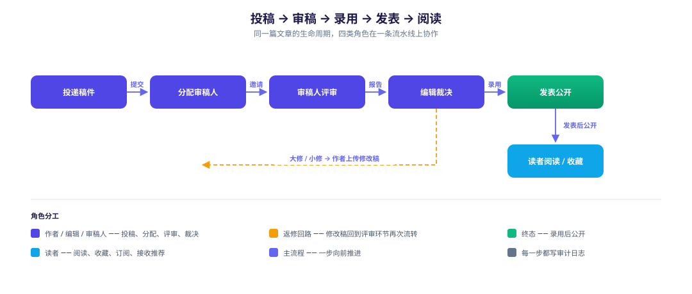
</div>

## 界面实拍

> 全部为**真实运行截图**——桌面 1440×900 · 移动端 390×844。点主图可看 60 秒演示。

<div align="center">

<a href="docs/assets/demo/ScholarHUB-promo.webm">
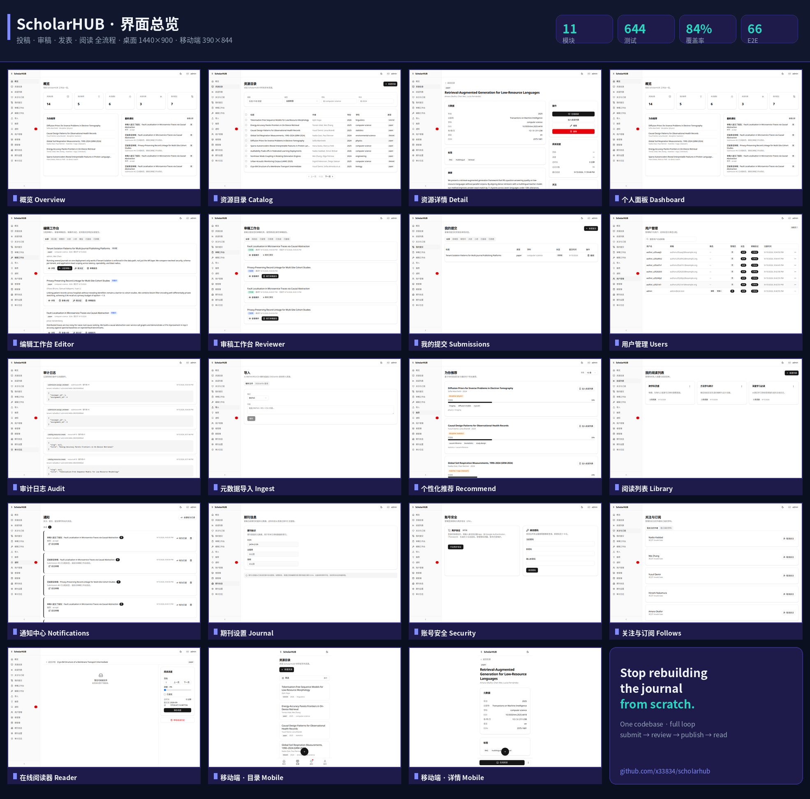
</a>

**▶ [观看 60 秒演示](docs/assets/demo/ScholarHUB-promo.webm)** · [全部 19 张截图](docs/assets/screenshots)

</div>

### 阅读 — 发现、查看、就地阅读

<table>
<tr>
<td width="33%" align="center">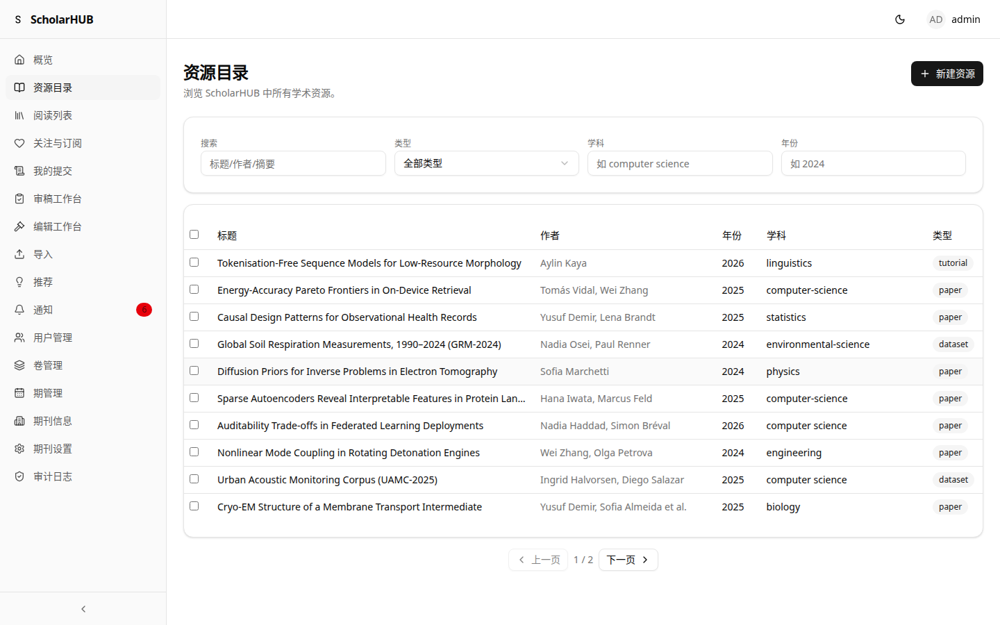<br /><sub><b>资源目录</b> — 对已发表作品的分类检索</sub></td>
<td width="33%" align="center">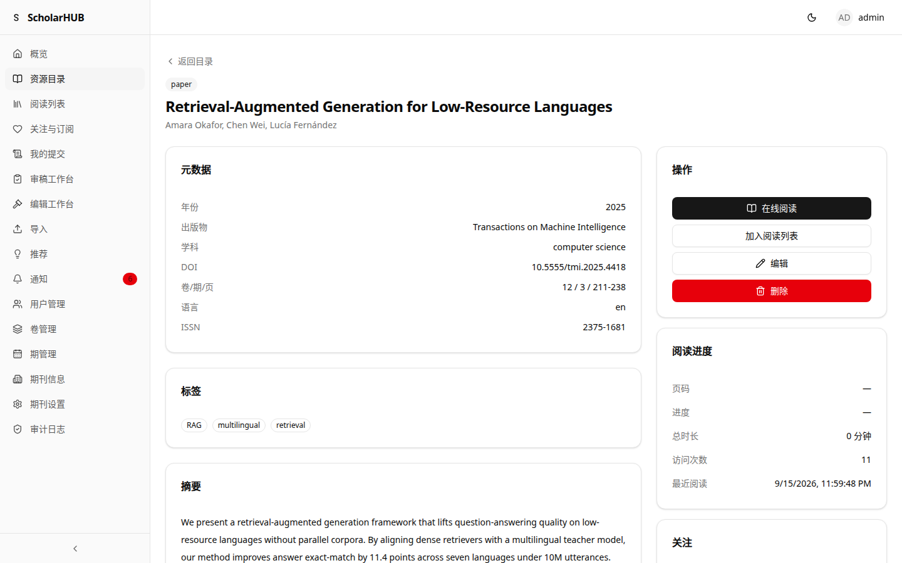<br /><sub><b>资源详情</b> — 元数据、DOI、摘要、文件</sub></td>
<td width="33%" align="center">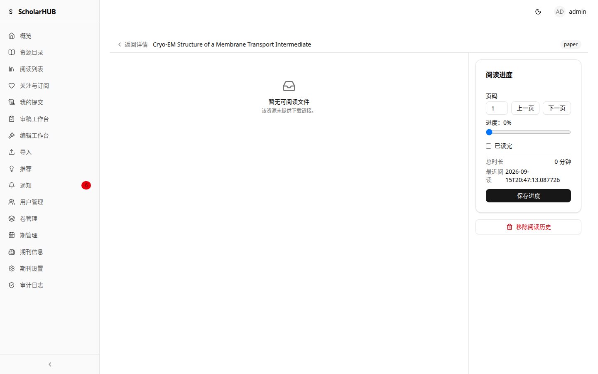<br /><sub><b>在线阅读器</b> — 浏览器内 PDF,进度跨设备同步</sub></td>
</tr>
</table>

### 发表 — 作者 → 编辑 → 审稿人闭环

<table>
<tr>
<td width="33%" align="center">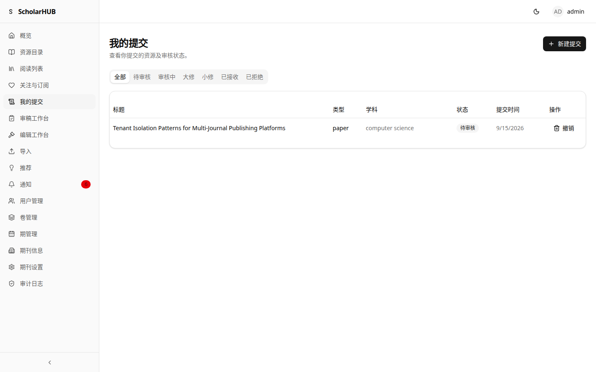<br /><sub><b>作者</b> — 投稿、修改稿与状态</sub></td>
<td width="33%" align="center">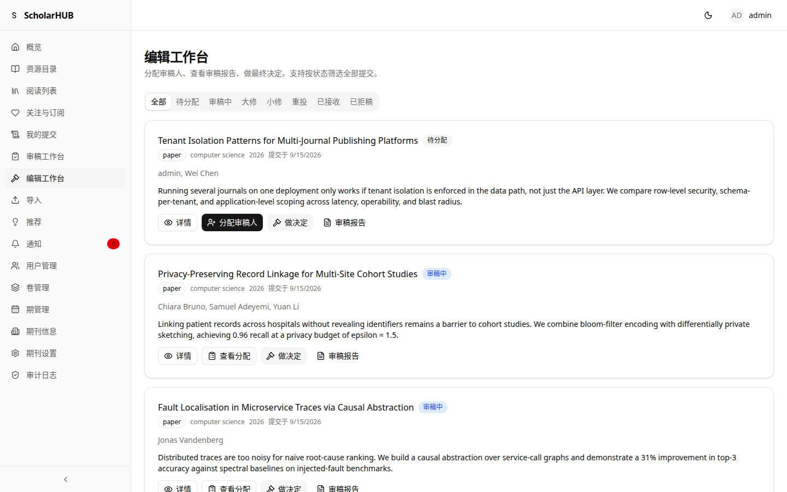<br /><sub><b>编辑</b> — 分配审稿人、裁决、发表</sub></td>
<td width="33%" align="center">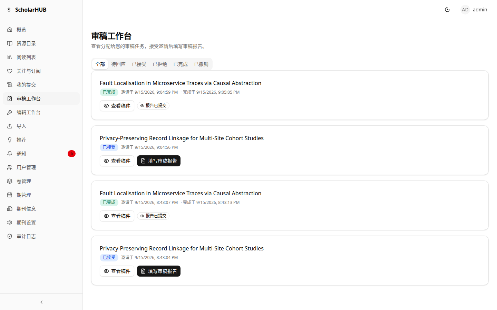<br /><sub><b>审稿人</b> — 阅读稿件、提交意见</sub></td>
</tr>
</table>

### 发现与运营 — 个性化与后台管理

<table>
<tr>
<td width="33%" align="center">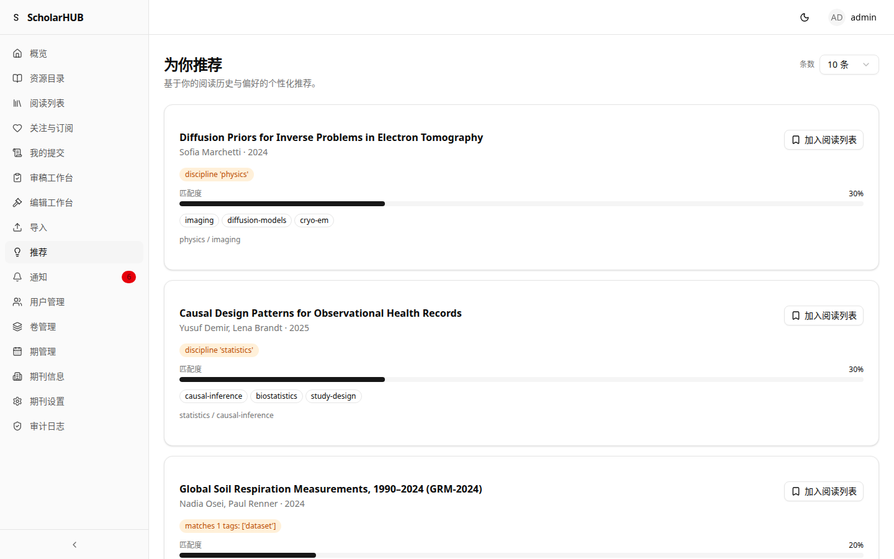<br /><sub><b>个性化推荐</b> — 按阅读历史排序</sub></td>
<td width="33%" align="center">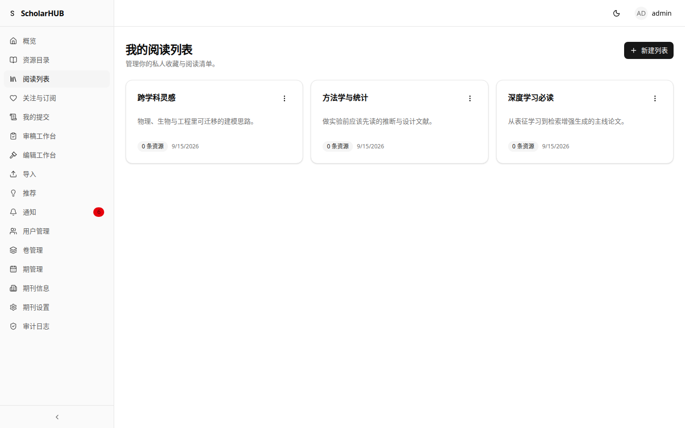<br /><sub><b>阅读列表</b> — 收藏与跨设备进度</sub></td>
<td width="33%" align="center">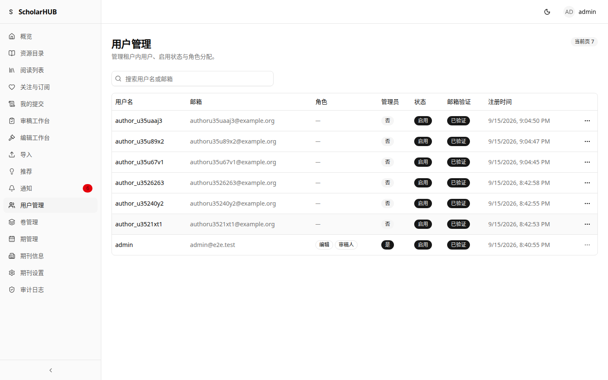<br /><sub><b>后台管理</b> — 用户、角色与审计日志</sub></td>
</tr>
</table>

## 核心能力

| 能力 | 亮点 |
|---|---|
| **投稿与审稿** | 完整元数据录入、单盲/双盲工作流、审稿人分配、带版本管理修改稿、编辑裁决、终态守卫 |
| **发表与目录** | 卷期管理、可检索的已发表目录、通过 DataCite 注册 DOI |
| **元数据抓取** | 从 Crossref、arXiv、PubMed、OpenAlex、Semantic Scholar 拉取权威记录,外加 BibTeX / RIS / CSV 导入 |
| **阅读体验** | 浏览器内 PDF 阅读、跨设备阅读进度同步、个人阅读列表、关注作者与学科 |
| **鉴权与安全** | WebAuthn Passkey、TOTP 双因素、JWT denylist + 密钥轮换、验证码、RBAC(作者/编辑/审稿人/读者/admin) |
| **多租户** | 一个部署托管多个期刊,基于 host 解析租户并带路由缓存 |
| **发现** | 关注关系图、个性化推荐、邮件 + 站内通知、引用导出(BibTeX / RIS / CSL) |

每个领域能力都是独立模块,可单独启用、替换或扩展,不触碰 core。

## 系统架构

<div align="center">
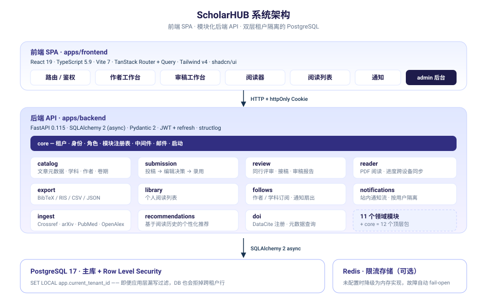
</div>

- **后端** — FastAPI(async)、SQLAlchemy 2.0 async、PostgreSQL / SQLite,模块化 `app/modules/*`,`mypy` 严格模式 + `ruff` 全绿。
- **前端** — React 19 + TanStack Router + TypeScript 5.9 + Tailwind v4 + shadcn/ui,端到端类型安全。
- **测试** — `pytest`(并行、行覆盖率 84%、硬性 `--cov-fail-under=80`)、前端 `vitest`、Playwright 跑完整的投稿 → 审稿 → 发表 → 阅读旅程。

### 两个值得记住的防御

- **双层租户隔离。** 每个领域表都带 `tenant_id`:应用层在每条查询上追加过滤,PostgreSQL 行级安全(RLS)即使应用层漏写也会拒掉跨租户行——纵深防御,不是靠祈祷。
- **模块注册表。** `app.core.modules.load_all()` 按依赖顺序加载模块、注册 ORM 表、挂载路由、加入健康检查。新能力 = 一处注册,core 零改动。

## 快速开始

### 方式一:Docker Compose(推荐)

```bash
# 1. 生成强密钥
echo "SCHOLARHUB_SECRET_KEY=$(openssl rand -hex 32)" > .env
echo "SCHOLARHUB_ADMIN_PASSWORD=$(openssl rand -base64 18)" >> .env

# 2. 启动 dev 栈(Postgres + 后端 + 前端)
docker compose -f infra/docker-compose.yml up --build

# 3. 打开 OpenAPI 文档与前端
xdg-open http://localhost:8000/docs
xdg-open http://localhost:5173
```

### 方式二:本地裸跑(开发)

需要 Python 3.12+、Node 20+、一个 PostgreSQL 17 实例。

```bash
# 后端
cd apps/backend && uv sync && uv run alembic upgrade head
uv run uvicorn app.main:app --reload

# 前端(另开一个终端)
cd apps/frontend && npm install && npm run dev
```

### 方式三:生产部署

```bash
cp .env .env.prod                 # 至少填好 SCHOLARHUB_SECRET_KEY 与 SCHOLARHUB_ADMIN_PASSWORD
# 改 infra/Caddyfile,把 scholarhub.example.com 换成你的域名
docker compose -f infra/docker-compose.prod.yml --env-file .env.prod up -d --build
```

> 邮件(Mailgun / SendGrid / SES / Postmark)与 OIDC SSO(Google / GitHub / Keycloak)接入见 [integrations.md](docs/integrations.md)。

## 技术栈

每一项都选用主流、长期可托管的方案,不放任何冷门依赖。

| 层 | 后端 | 前端 |
|---|---|---|
| 语言 / 框架 | Python 3.12+、FastAPI 0.115+ | React 19、TypeScript 5.9、Vite 7 |
| 数据 | SQLAlchemy 2(async)、Alembic、PostgreSQL 17 | TanStack Router v1、TanStack Query v5、Zustand |
| 校验 / 鉴权 | Pydantic 2、JWT + bcrypt、PyJWT、authlib(OIDC) | shadcn/ui + Radix、Tailwind v4、lucide-react |
| 基础设施 | Docker Compose、Caddy(自动 TLS)、structlog | Playwright(E2E) |
| 工具链 | uv、ruff、mypy(strict)、pytest、bandit | ESLint、Vitest、tsc 工程引用 |

所有变量以 `SCHOLARHUB_` 为前缀。完整列表与 `.env` 模板见 [`apps/backend/app/core/config.py`](apps/backend/app/core/config.py) 与 [`apps/backend/.env.example`](apps/backend/.env.example)。核心几项:`SCHOLARHUB_SECRET_KEY`、`SCHOLARHUB_ADMIN_PASSWORD`、`SCHOLARHUB_DATABASE_URL`、`SCHOLARHUB_TENANCY_MODE`(`single` / `multi`)、`SCHOLARHUB_ENVIRONMENT`。

## 安全

纵深防御在后端启动的那一刻即全部开启:

- **认证** — bcrypt 哈希;短有效期 JWT access + httpOnly 刷新 Cookie + 每用户 `token_version`。
- **双因素(TOTP)** — RFC 6238,每用户密钥 Fernet 加密存储,10 个一次性备份码(SHA-256)。
- **Passkey** — WebAuthn 注册/认证状态机,挑战一次性且带 TTL。
- **JWT 密钥轮换** — 有序密钥链;`POST /api/admin/reload-secret-keys` 零停机轮换。
- **限流** — 按 IP + 路由的滑动窗口;设了 `SCHOLARHUB_REDIS_URL` 走 Redis,否则内存( Redis 故障自动 fail-open)。
- **GDPR** — 自助导出 / 软删除(30 天宽限)/ 恢复端点。
- **响应头与错误** — CSP、HSTS、CSRF 双提交;错误统一走 RFC 7807 `application/problem+json`;每个特权操作按租户记审计日志。

完整策略与威胁模型见 [SECURITY.md](SECURITY.md)。

## 默认角色

启动时 core 自动创建以下角色(可在 admin 后台再分配):

| 角色 | 范围 |
|---|---|
| `admin` | 全部权限——admin 后台、用户管理、审计日志 |
| `editor` | 分配审稿人、组织卷期、录用/拒稿、推到"已发表" |
| `reviewer` | 查看分配给自己的稿件、提交审稿意见 |
| `author` | 投递稿件、查看自己稿件状态、上传修改稿 |
| `member` | 阅读、收藏、订阅、查看推荐 |

## 测试

质量由 CI 兜底,不是嘴上说说:

- **后端** — **644** 个 `pytest` 用例,行覆盖率 **84%**,硬性门槛 `--cov-fail-under=80`;`mypy --strict` 与 `ruff` 全绿。
- **前端** — `vitest` 单元 + 组件测试,严格 `tsc` 下 **100** 个用例。
- **E2E** — **66** 个 Playwright 用例,在 Playwright 拉起的真实服务上跑投稿 → 审稿 → 发表 → 阅读全流程(不靠脆弱的生产环境 parity)。
- **CI** — 每次推送都跑后端 / 前端 / E2E 三个 job;pytest 严格 marker;版本一致性守卫让 `VERSION` / `pyproject` / `package.json` / `__version__` 始终一致。

```bash
# 后端
cd apps/backend && uv run ruff check . && uv run mypy app && uv run pytest -q

# 前端
cd apps/frontend && npm run lint && npm run typecheck && npm run test

# E2E(Playwright 通过 E2E_SPAWN_SERVER=1 自行拉起两个服务)
cd apps/frontend && E2E_SPAWN_SERVER=1 npx playwright test
```

## 文档

- [架构](docs/ARCHITECTURE.md) · [部署](docs/DEPLOYMENT.md) · [集成](docs/integrations.md)
- [贡献](CONTRIBUTING.md) · [安全](SECURITY.md) · [行为准则](CODE_OF_CONDUCT.md) · [帮助](SUPPORT.md) · [变更记录](CHANGELOG.md)

## 贡献

欢迎提 issue 或 PR——分支命名、提交规范、PR 检查表见 [CONTRIBUTING.md](CONTRIBUTING.md)。

## 仓库地址

四平台并列同步（分支 / 标签 / HEAD 完全一致），不偏心任何一个，任选其一：

| 平台 | 地址 |
|---|---|
| **GitHub** | <https://github.com/x33834/scholarhub> |
| **GitHub** | <https://github.com/Morningstar202604/scholarhub> |
| **GitCode** | <https://gitcode.com/badhope/scholarhub> |
| **Gitee** | <https://gitee.com/badhope/scholarhub> |

**🌐 官方网站**（GitHub Pages 双号部署，内容一致）：<https://x33834.github.io/scholarhub/> · <https://morningstar202604.github.io/scholarhub/>

## 项目状态

**版本**:`0.2.0` · **状态**:pre-alpha

11 个模块全部 shipped,前后端 + 数据库迁移 + 单元测试 + E2E + 部署均已就绪。核心出版主流程可用且经过测试;API 仍在稳定中,暂不建议作为正式出版的唯一系统。

## License

Copyright © 2026 Morningstar202604. 基于 [Apache-2.0 License](LICENSE) 发布。按"现状"提供,不附带任何担保。
